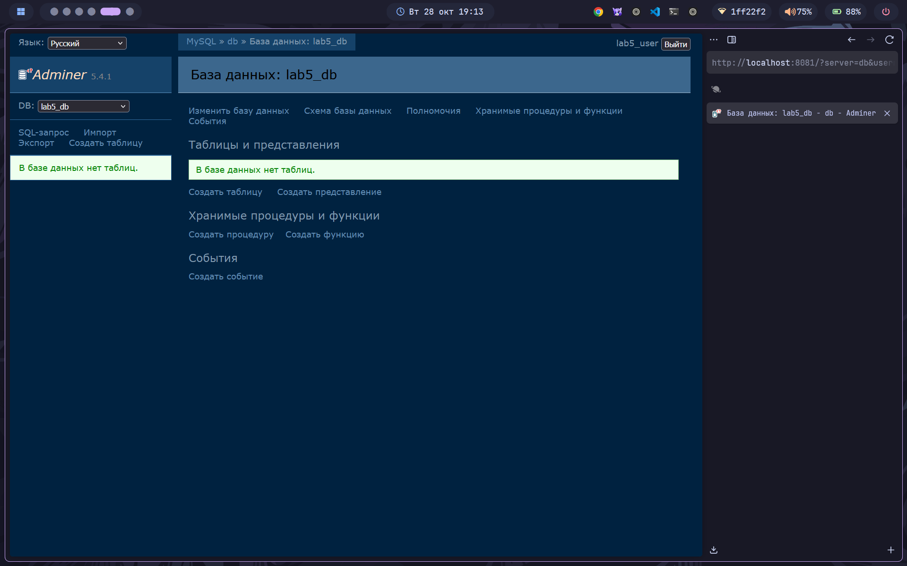
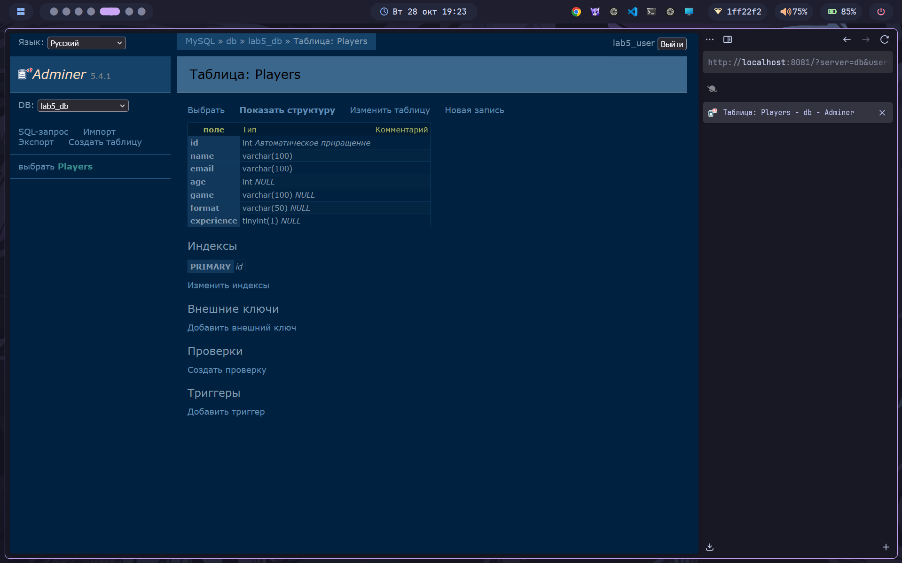
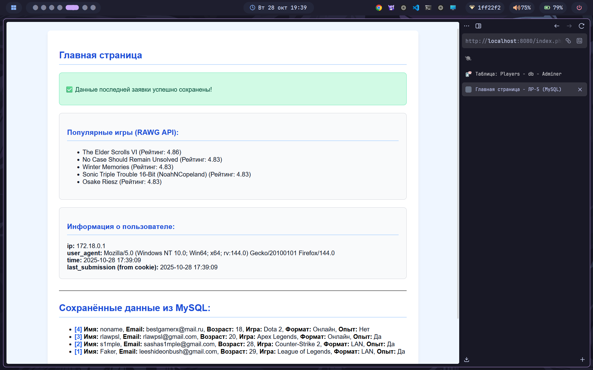

# Лабораторная работа №5: Работа с базой данных MySQL


---

## 👩‍💻 Автор
**ФИО:** Товмасян Грайр Артурович  
**Группа:** 3МО-2

---

## 📌 Описание задания
Целью работы было полное переключение проекта на работу с реляционной базой данных **MySQL**. Реализованы следующие ключевые задачи:

1.  Расширение Docker-конфигурации для включения сервисов **MySQL** и **Adminer**.
2.  Создание PHP-класса для работы с таблицей (`Player.php`).
3.  Сохранение данных формы напрямую в базу данных.
4.  Вывод всех записей из базы данных на главной странице.

---

## ⚙️ Точки доступа

| Сервис        | Адрес                   | Учетные данные (для Adminer) |
| ------------- | ----------------------- | --------------------------- |
| **Сайт**      | [http://localhost:8080] | -                           |
| **Adminer**   | [http://localhost:8081] | Система: `db`, Пользователь: `lab5_user`, Пароль: `lab5_pass`, База данных: `lab5_db` |

---

## 🚀 Как запустить проект

1.  **Клонировать репозиторий:**
    ```bash
    git clone https://github.com/rpaup/nginx-lab.git
    cd nginx-lab
    ```

2.  **Установить PHP-зависимости (Guzzle):**
    ```bash
    docker-compose run --rm php composer install
    ```

3.  **Запустить Docker-окружение (сборка PHP и запуск всех 4-х контейнеров):**
    ```bash
    docker-compose up -d --build
    ```

4.  **Создать таблицу:** После запуска, зайдите в Adminer (http://localhost:8081) и выполните SQL-запрос:
    ```sql
    CREATE TABLE IF NOT EXISTS Players (
        id INT AUTO_INCREMENT PRIMARY KEY,
        name VARCHAR(100) NOT NULL,
        email VARCHAR(100) NOT NULL,
        age INT,
        game VARCHAR(100),
        format VARCHAR(50),
        experience TINYINT(1)
    );
    ```

---

## 📸 Скриншоты выполнения

### 1. Подключение к Adminer и структура БД
Подключение к MySQL-серверу через Adminer (порт 8081).


Созданная таблица `Players` в базе данных `lab5_db`.



### 2. Вывод данных из базы данных
Главная страница (index.php) отображает список всех сохраненных записей, извлеченных напрямую из таблицы `Players`.



---

## ✅ Результат
Проект успешно переведен на работу с полноценной базой данных. Вся логика сохранения и извлечения данных реализована через **объектно-ориентированный подход** (класс `Player`) с использованием расширения **PDO** для безопасного взаимодействия с MySQL.