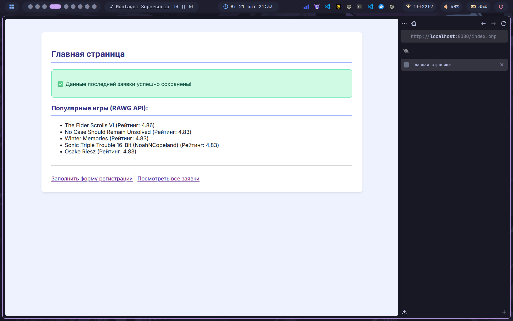
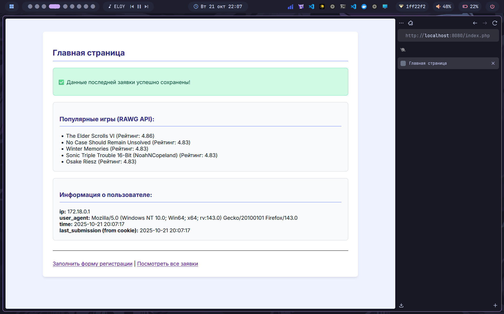

# Лабораторная работа №4: Composer, классы и API

---

## 👩‍💻 Автор
**ФИО:** Товмасян Грайр Артурович  
**Группа:** 3МО-2

---

## 📌 Описание задания
Целью работы было освоение менеджера зависимостей **Composer**, работа с **PHP-классами** и интеграция публичного **API** для получения внешних данных.

---

## ⚙️ Основные нововведения

-   **Composer:** Инициализирован `composer.json` и подключена внешняя библиотека `guzzlehttp/guzzle` для выполнения HTTP-запросов. Все зависимости находятся в папке `vendor/`.
-   **Класс `ApiClient`:** Создан специальный класс-обертка (`www/ApiClient.php`) для инкапсуляции логики работы с API.
-   **Класс `UserInfo`:** Создан статический класс (`www/UserInfo.php`) для сбора информации о пользователе (IP, User Agent).
-   **Работа с API:** После успешной отправки формы, PHP-скрипт `process.php` делает запрос к публичному API (RAWG) для получения списка игр.
-   **Cookie:** После отправки формы устанавливается cookie `last_submission`, чтобы хранить время последней успешной операции.

---

## 📸 Скриншоты выполнения

### 1. Интеграция API
После отправки формы на главной странице отображаются данные, полученные из публичного API.

### 2. Информация о пользователе и Cookie
На главной странице отображается информация о сеансе (IP, User Agent) и время последней отправки, которое считывается из cookie.

---

## ✅ Результат
В ходе работы были успешно освоены базовые принципы работы с Composer для управления зависимостями. Функциональность проекта была разделена на логические классы. Реализована интеграция с внешним публичным API и продемонстрирована работа с cookie для сохранения информации между запросами пользователя.