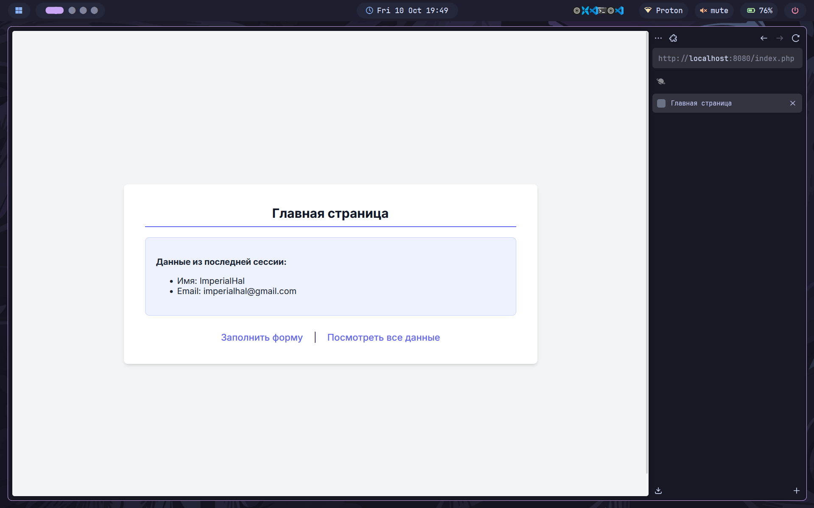
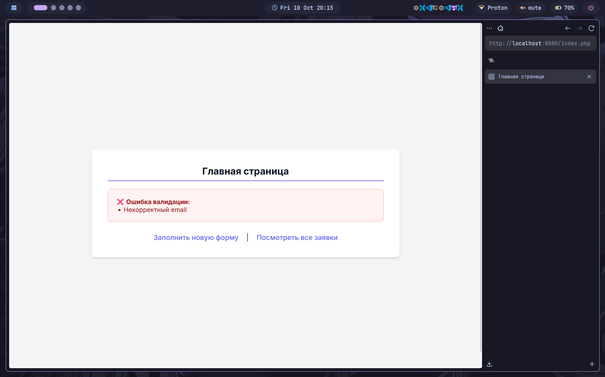

# Лабораторная работа №3: Серверная обработка форм на PHP

---

## 👩‍💻 Автор
**ФИО:** Товмасян Грайр Артурович  
**Группа:** 3МО-2

---

## 📌 Описание задания
Целью работы было реализовать полноценную серверную обработку HTML-формы с помощью PHP. Функционал включает в себя:
*   Получение данных из формы методом `POST`.
*   Валидацию полученных данных на стороне сервера.
*   Использование PHP-сессий для передачи сообщений пользователю (об успехе и ошибках).
*   Сохранение всех корректных записей в текстовый файл `data.txt`.
*   Создание отдельной страницы для просмотра всех сохраненных записей из файла.

**Главная страница проекта:** [http://localhost:8080](http://localhost:8080)

---

## ⚙️ Как запустить проект
1.  Клонировать репозиторий.
2.  Выполнить в корневой папке команду `docker-compose up -d --build`.
3.  Открыть сайт в браузере по указанному выше адресу.

---

## 📸 Этапы выполнения

Ниже представлены скриншоты, демонстрирующие ключевые функции, реализованные в ходе работы.

### 1. Вывод данных из сессии
После успешной отправки формы главная страница показывает данные, которые были сохранены в сессию, подтверждая корректную обработку.

### 2. Просмотр всех сохраненных записей
Страница `view.php` корректно читает все данные из файла `data.txt` и отображает их в виде удобной таблицы.

### 3. Серверная валидация данных
При отправке некорректных данных (например, пустого имени или неверного формата email) на главной странице выводятся сообщения об ошибках, сохраненные в сессию.

---

## ✅ Результат
Приложение успешно обрабатывает HTML-формы на стороне сервера, а не на клиенте. Реализованы все ключевые требования: серверная валидация данных, работа с сессиями для обратной связи с пользователем и сохранение данных в файл с последующим выводом. Все цели лабораторной работы достигнуты.