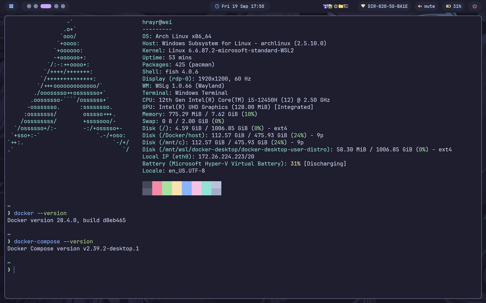
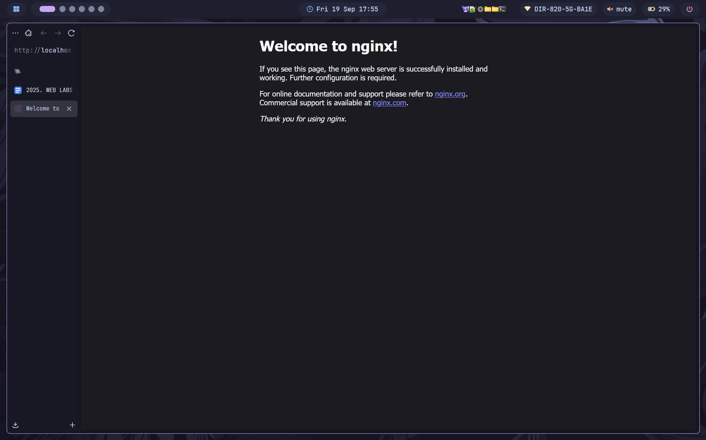
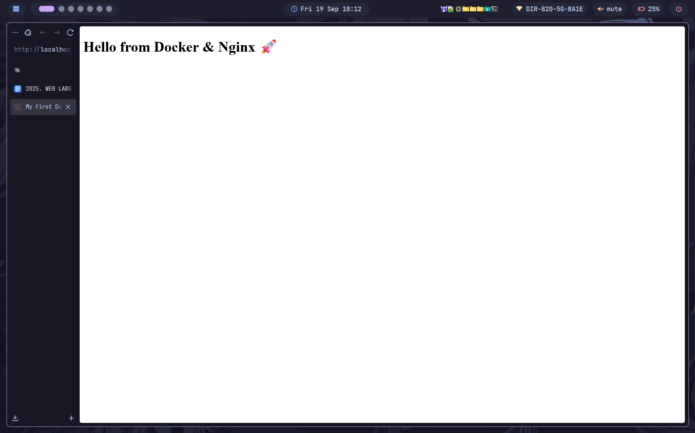
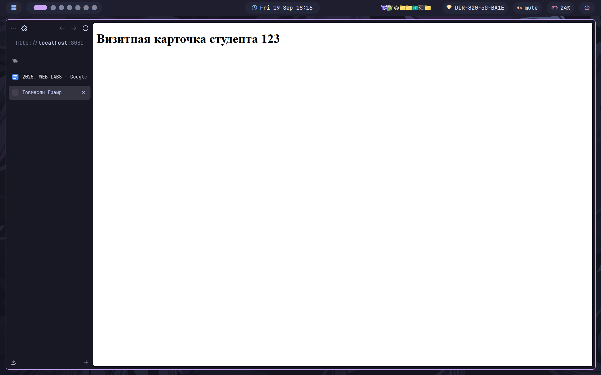
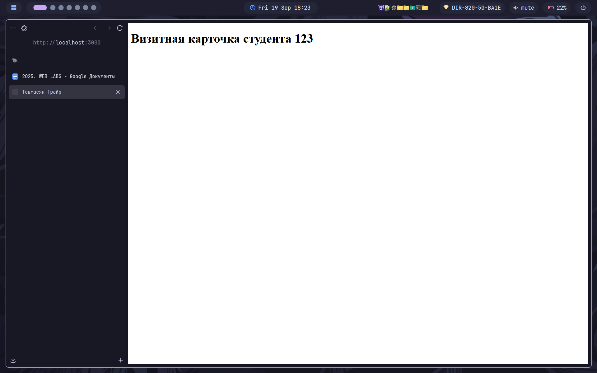

# Лабораторная работа №1: Nginx + Docker

## 👩‍💻 Автор
ФИО: Товмасян Грайр Артурович  
Группа: 3МО-2

---

## 📌 Описание задания
Создать веб-сервер в Docker с использованием Nginx и подключить HTML-страницу.  
Результат доступен по адресу [http://localhost:3000](http://localhost:3000).

---

## ⚙️ Как запустить проект

1. Клонировать репозиторий:
   ```bash
   git clone https://github.com/rpaup/nginx-lab.git
   cd nginx-lab
Запустить контейнеры:
```bash
docker-compose up -d --build
```
Открыть в браузере:
```http://localhost:3000```
📂 Содержимое проекта

```docker-compose.yml``` — описание сервиса Nginx

```code/index.html``` — главная HTML-страница

```screenshots/``` — все скриншоты

📸 Скриншоты работы

1. Проверка установки Docker



2. Стартовая страница Nginx (порт 8080)



3. Отображение кастомной страницы `index.html`



4. Изменение текста на главной странице



5. Добавление страницы `about.html`


6. Сайт на новом порту (3000)



✅ Результат
Сервер в Docker успешно запущен, Nginx отдаёт мою HTML-страницу.
