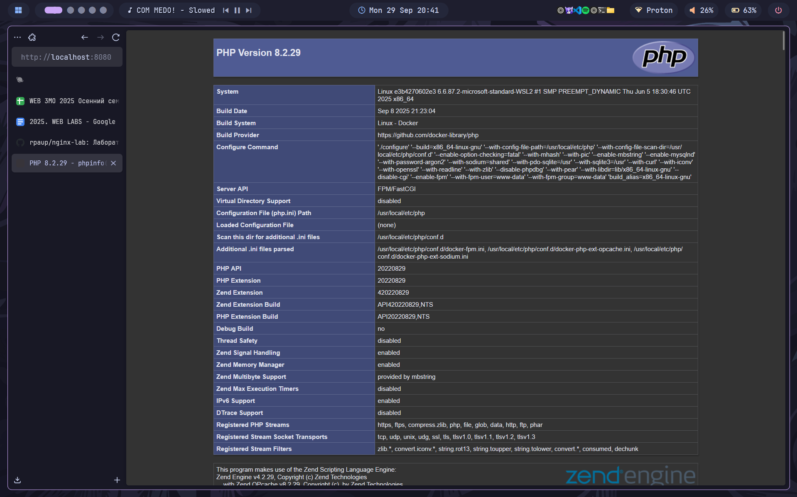
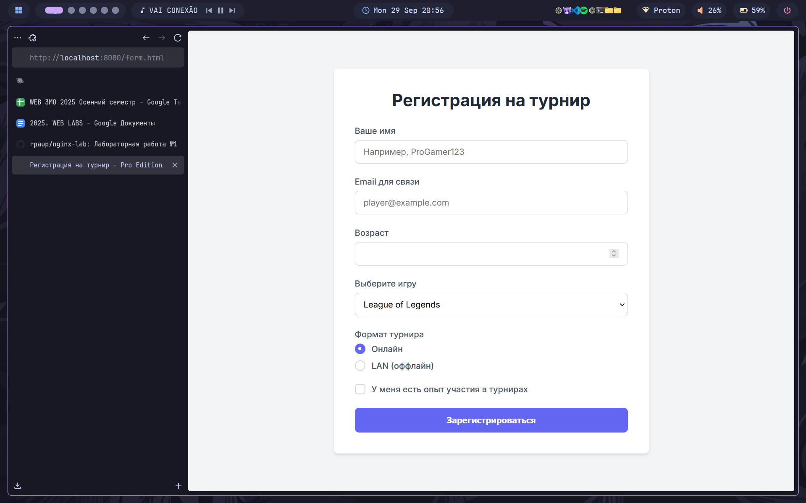
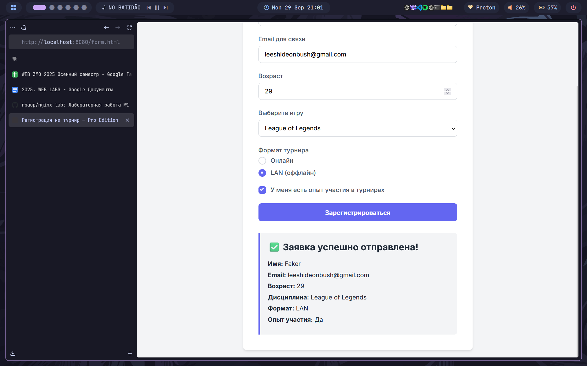

# Лабораторная работа №2: Nginx + PHP-FPM + JS Forms

---

## 👩‍💻 Автор
**ФИО:** Товмасян Грайр Артурович   
**Группа:** 3МО-2

---

## 📌 Описание задания
Целью работы было расширение проекта из первой лабораторной:
1. Добавить в Docker-сборку сервис с **PHP-FPM**.
2. Настроить **Nginx** для обработки `.php` файлов.
3. Создать HTML-форму и реализовать её **обработку на JavaScript** без перезагрузки страницы.

**Результат доступен по адресам:**
- Проверка PHP: [http://localhost:8080/index.php](http://localhost:8080/index.php)
- Форма регистрации: [http://localhost:8080/form.html](http://localhost:8080/form.html)

---

## ⚙️ Как запустить проект
1. **Клонировать репозиторий:** `git clone https://github.com/rpaup/nginx-lab.git`
2. **Перейти в папку проекта:** `cd nginx-lab`
3. **Запустить Docker-контейнеры:** `docker-compose up -d --build`
4. **Открыть сайт в браузере.**

---

## 📂 Структура проекта
- `docker-compose.yml` — Конфигурация для запуска Nginx и PHP-FPM.
- `nginx/default.conf` — Конфигурация Nginx для обработки статики и PHP.
- `www/` — Исходный код сайта.
- `screenshots/` — Скриншоты выполнения работы.

---

## 📸 Этапы выполнения (скриншоты)
### 1. Проверка работы связки Nginx и PHP-FPM

### 2. Создание HTML-формы (структура)

### 3. Обработка формы на JavaScript

---

## ✅ Результат
Инфраструктура в Docker развёрнута. Nginx корректно обрабатывает статику и PHP-скрипты. Интерактивная форма на JavaScript работает согласно заданию.